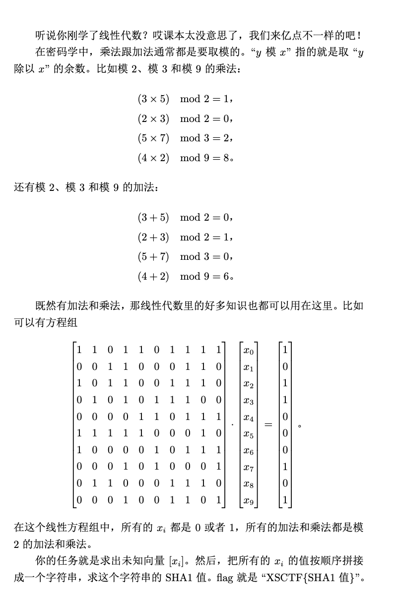

# Simple-Math

## 知识点

`python矩阵运算`

## 解题



使用代码

```python
import numpy as np
import galois # 伽罗瓦域
import hashlib
GF = galois.GF(2) # Ax = b mod 2
A = GF([[1, 1, 0, 1, 1, 0, 1, 1, 1, 1],
        [0, 0, 1, 1, 0, 0, 0, 1, 1, 0],
        [1, 0, 1, 1, 0, 0, 1, 1, 1, 0],
        [0, 1, 0, 1, 0, 1, 1, 1, 0, 0],
        [0, 0, 0, 0, 1, 1, 0, 1, 1, 1],
        [1, 1, 1, 1, 1, 0, 0, 0, 1, 0],
        [1, 0, 0, 0, 0, 1, 0, 1, 1, 1],
        [0, 0, 0, 1, 0, 1, 0, 0, 0, 1],
        [0, 1, 1, 0, 0, 0, 1, 1, 1, 0],
        [0, 0, 0, 1, 0, 0, 1, 1, 0, 1]])
A_inv = np.linalg.inv(A)
b = GF([1,0,1,1,0,0,0,1,0,1])
x = A_inv@b
print(x)
x_to_str = ''.join(map(str,x))
print(x_to_str)
flag='XSCTF{'+hashlib.sha1(x_to_str.encode('utf-8')).hexdigest()+'}'
print(flag)
```

