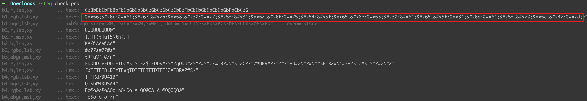
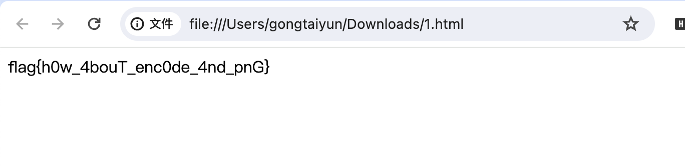

# check

## 知识点

`html编码`

## 解题

`zsteg`找到了一串类似html实体编码的东西

```
&#x66;&#x6c;&#x61;&#x67;&#x7b;&#x68;&#x30;&#x77;&#x5f;&#x34;&#x62;&#x6f;&#x75;&#x54;&#x5f;&#x65;&#x6e;&#x63;&#x30;&#x64;&#x65;&#x5f;&#x34;&#x6e;&#x64;&#x5f;&#x70;&#x6e;&#x47;&#x7d
```



直接保存为`1.html`，浏览器打开即可获得`flag`

