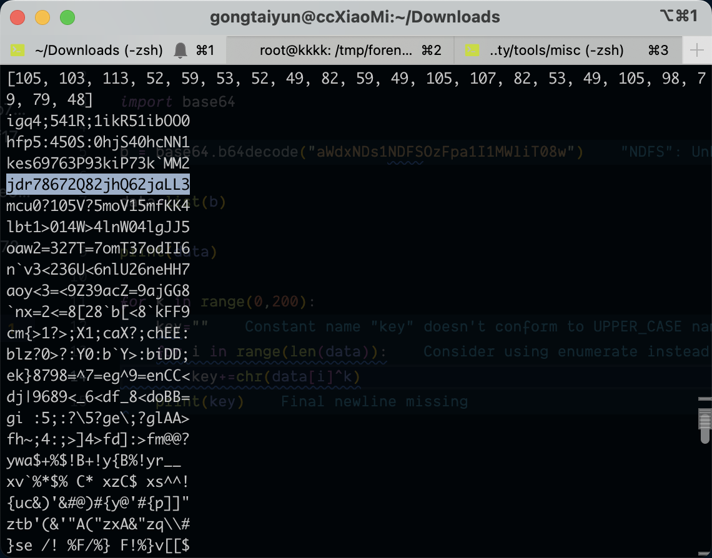

# halo

## 知识点

`base64和异或`

## 解题

base64解密后得到

```
igq4;541R;1ikR51ibOO0
```

猜测`base64`和异或，尝试

```python
import string

from base64 import *

b=b64decode("aWdxNDs1NDFSOzFpa1I1MWliT08w")

data=list(b)

for k in range(0,200):
    key=""
    for i in range(len(data)):
        key+=chr(ord(data[i])^k)
    print (key)
```

