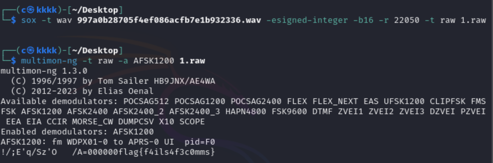

# latlong

## 知识点

`multimon`

## 解题

需要使用sox工具将wav音频文件转化为raw类型文件

```
sox -t wav 997a0b28705f4ef086acfb7e1b932336.wav -esigned-integer -b16 -r 22050 -t raw 1.raw
```

然后使用`multimon`

```bash
multimon-ng -t raw -a AFSK1200 1.raw
```

