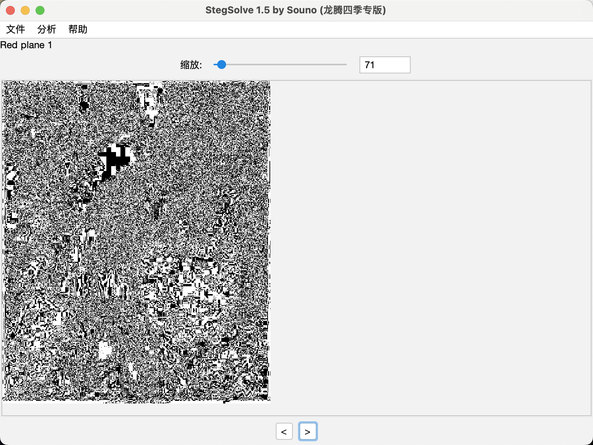
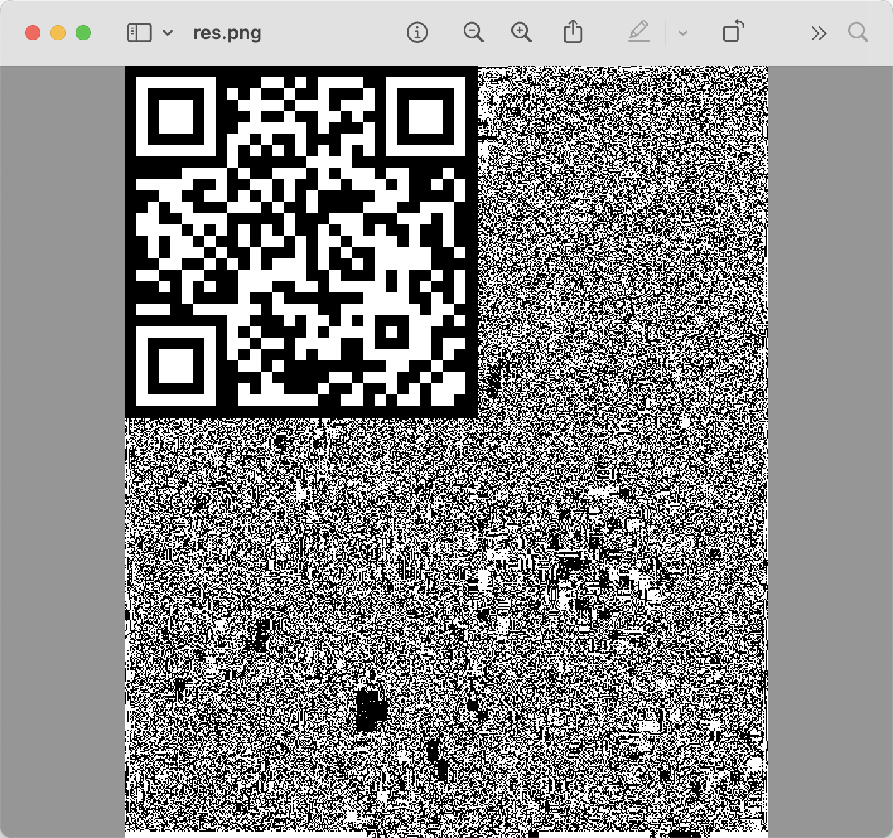
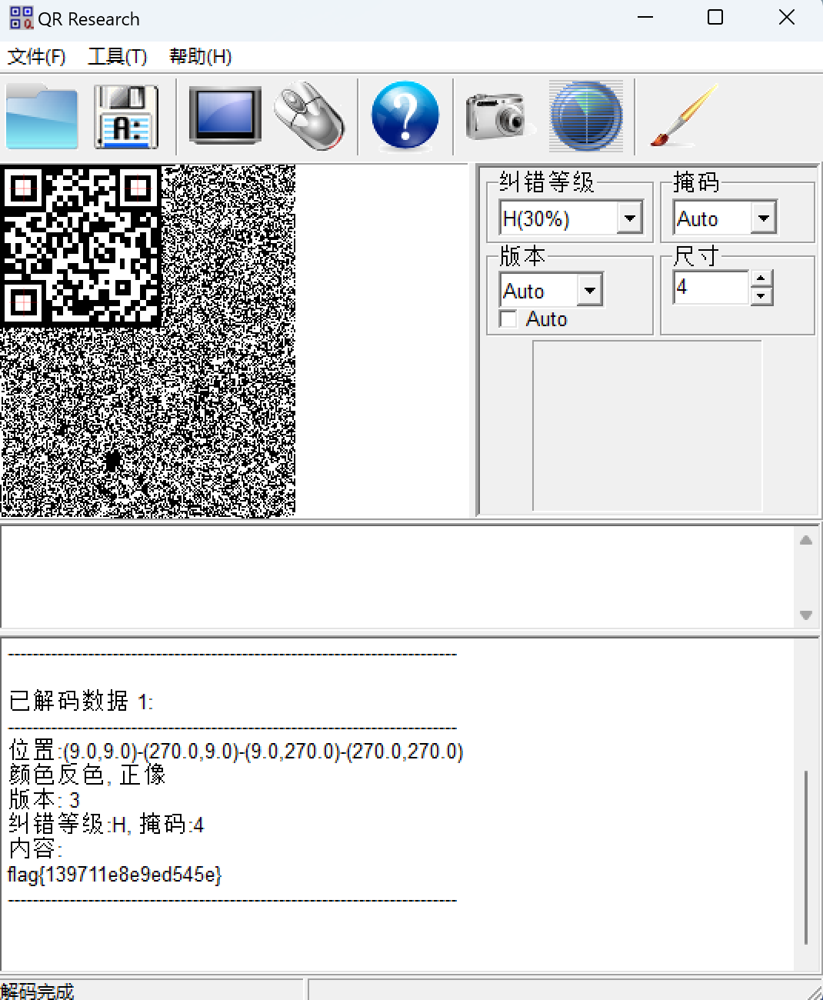

# low

## 知识点

`像素处理`

## 解题



发现似乎是被隐藏的二维码，使用`python`代码

```python
from PIL import Image

img = Image.open('./low.bmp')

tmp_img = img.copy()

pix = tmp_img.load()

width, height = tmp_img.size

for w in range(width):
    for h in range(height):
        if pix[w, h] & 1 == 0:
            pix[w, h] = 0
        else:
            pix[w, h] = 255

# tmp_img.show()
tmp_img.save('res.png')
```



