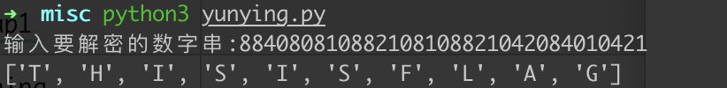

# m0_01

## 知识点

`usb流量`

`云影密码`

## 解题

首先给了一个流量包，使用`wireshark`打开时发现是`usb`流量，尝试使用`UsbKeyboardDataHacker`解密，发现解密后为一串加密字符


发现秘文都是`0 1 2 4 8`，猜测是云影密码，使用[01248云影密码](https://www.jianshu.com/p/b5aa5cf60f83)这里的代码解密

```python

#!/usr/bin/python
# -*- coding=utf8 -*-
"""
# @Author : pig
# @CreatedTime:2019-11-2423:54:02
# @Description : 
"""


def de_code(c):
    dic = [chr(i) for i in range(ord("A"), ord("Z") + 1)]
    flag = []
    c2 = [i for i in c.split("0")]
    for i in c2:
        c3 = 0
        for j in i:
            c3 += int(j)
        flag.append(dic[c3 - 1])
    return flag

def encode(plaintext):
    dic = [chr(i) for i in range(ord("A"), ord("Z") + 1)]
    m = [i for i in plaintext]
    tmp = [];flag = []
    for i in range(len(m)):
        for j in range(len(dic)):
            if m[i] == dic[j]:
                tmp.append(j + 1)
    for i in tmp:
        res = ""
        if i >= 8:
            res += int(i/8)*"8"
        if i%8 >=4:
            res += int(i%8/4)*"4"
        if i%4 >=2:
            res += int(i%4/2)*"2"
        if i%2 >= 1:
            res += int(i%2/1)*"1"
        flag.append(res + "0")
    print ("".join(flag)[:-1])

c = input("输入要解密的数字串:")
print (de_code(c))
#m_code = input("请输入要加密的数字串:")
#encode(m_code)
```

