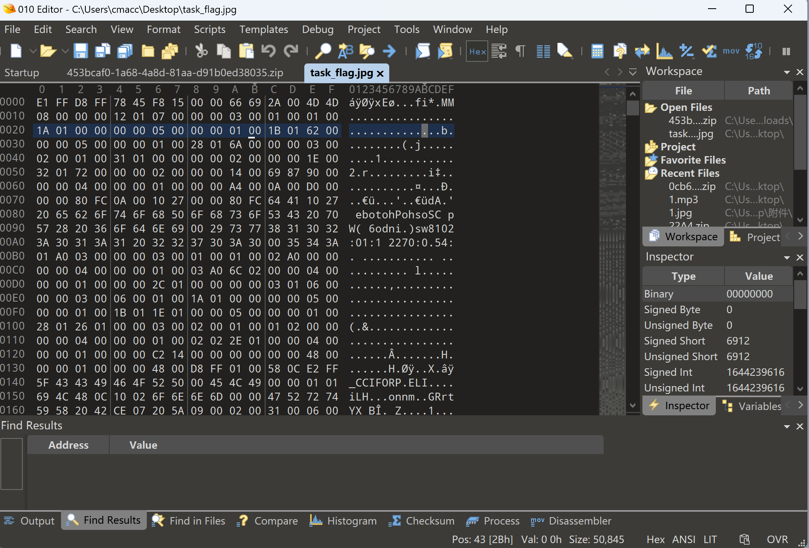
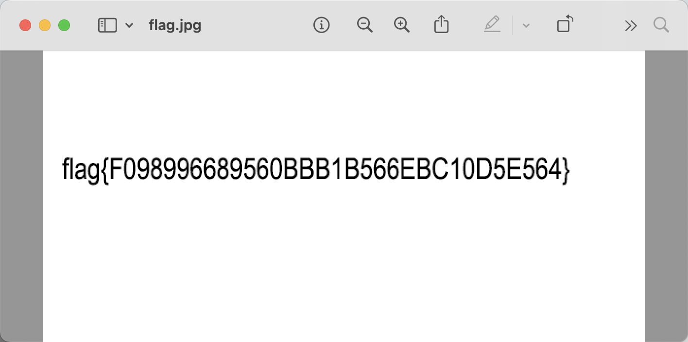

# misc2-1

## 知识点

`hex四位反转`

## 解题

`010editor`打开`jpg`文件，发现`hex`编码四位做了反转，



编写代码再次反转回来

```python
f = open('./task_flag.jpg', 'rb').read()
len_f = len(f)
flag_f = open('./flag.jpg', 'wb')

i = 0

while i < len_f:
    flag_f.write(f[i:i+4][::-1])
    i += 4

flag_f.close()
```

