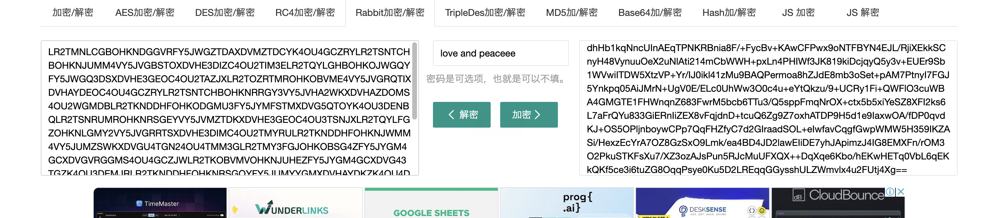
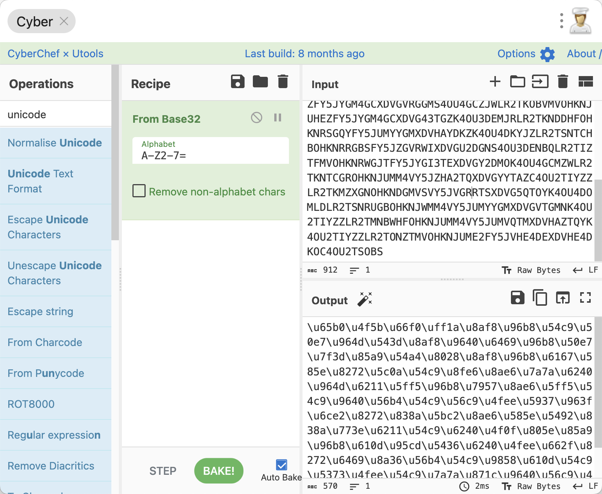
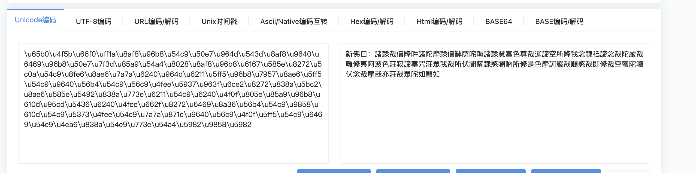
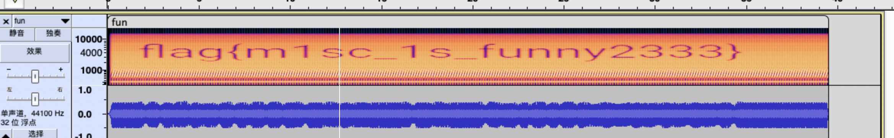

# miss_01

## 知识点

## 解题

给了一个加密的压缩包，但是没有发现伪加密，在`binwalk`时发现有其他文件，分离出了一个`omisc.docx`，打开后给了一串`rabbit`加密的数据，且显示隐藏段落标记时发现了`隐藏信息`

在`www.verymuch.net`进行希尔解密，密钥为`www.verymuch.net`，我做题的时候没有了，换了个网站解密

然后用解密出来的字符串作为密钥解密`rabbit`加密后的字符串

再进行`base32`解密发现了`unicode`编码

然后转中文

然后新佛曰解密

该密码用于解压压缩包，解压后给了一个`.wav`文件，使用`audacity`打开多视角即可看到`flag`

`flag{m1sc_1s_funny2333}`