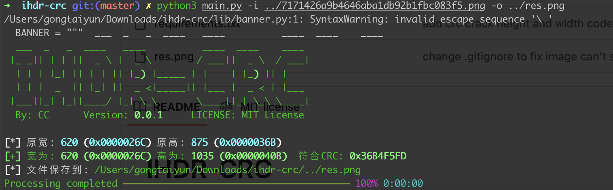

# normal_png

## 知识点

`图片隐藏宽高`

## 解题

给出的图片用`exiftool` `strings` `zsteg` `binwalk`都没找到东西，猜测是`crc`隐藏宽高，使用https://github.com/cmacckk/ihdr-crc

```bash
python3 main.py -i ../7171426a9b4646aba1db92b1fbc083f5.png -o ../res.png
```



