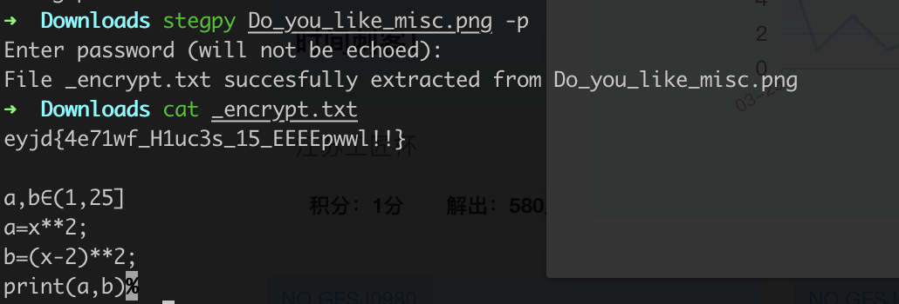
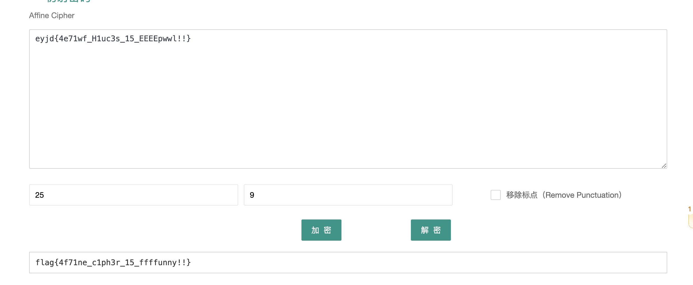
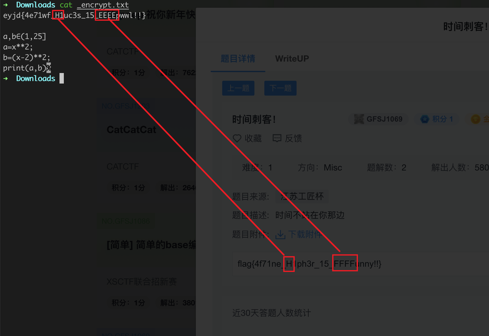

# steg没有py

## 知识点

`steg-py`

## 解题

安装题目环境

```bash
python3 -m pip install stegpy
```

然后运行

```bash
stegpy Do_you_like_misc.png -p
Enter password:Do_you_like_misc
```

即可解密



a、b的值范围都是(1,25]，需要两个参数的，且参数范围符合的加密方法是 放射密码(Affine)

遍历到`a`为`25`，`b`为`9`时解密



最后修改为秘文对应的大小写

