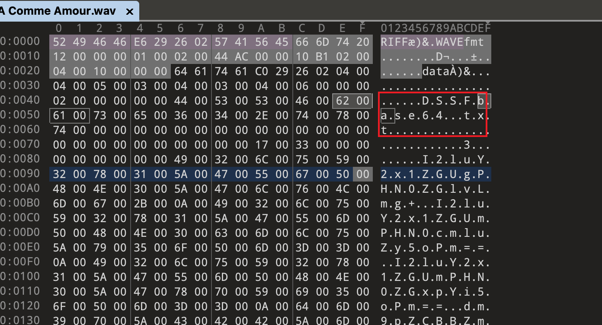
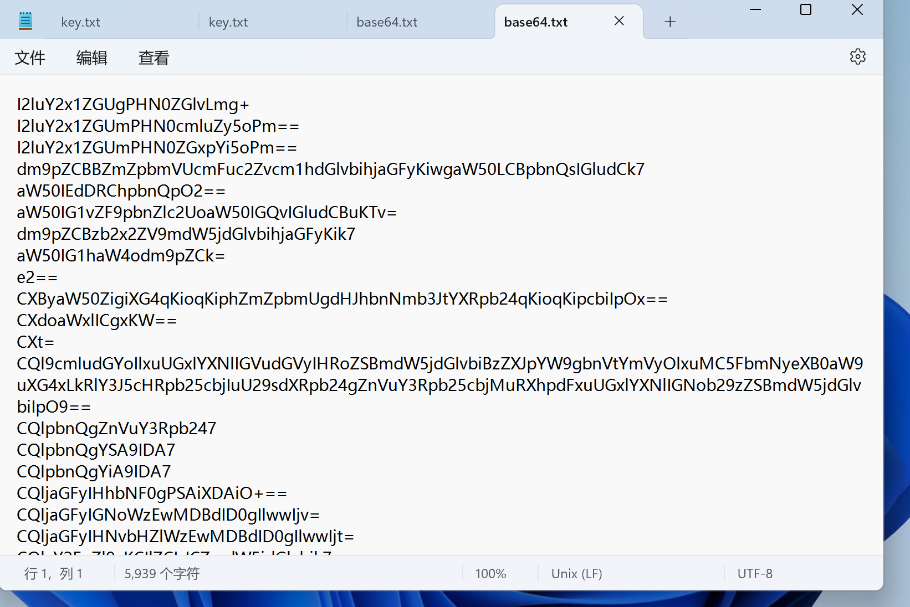
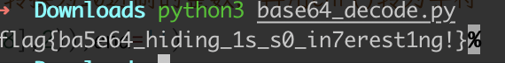

# 不确定,再看看

## 知识点

`base64隐写`

## 解题

给了一个`.wav`文件，使用`010editor`打开发现一个`base64.txt`



使用`deepsound`导出`base64.txt`




使用`base64`隐写解密脚本

```python
import re
import base64

b64chars = 'ABCDEFGHIJKLMNOPQRSTUVWXYZabcdefghijklmnopqrstuvwxyz0123456789+/'

# ccc.txt为待解密的base64隐写字符串所在的文件
f = open('base64.txt','r')
base64str = f.readline()

# pattern2用于匹配两个等号情况时，等号前的一个字符
# pattern2用于匹配一个等号情况时，等号前的一个字符
pattern2 = r'(\S)==$'
pattern1 = r'(\S)=$'

# 提取后的隐写二进制字符加入binstring中
binstring = ''

# 逐行读取待解密的base64隐写字符串，逐行处理
while(base64str):
    # 先匹配两个等号的情况，如果匹配不上，再配置一个等号的情况
    # 如果无等号，则没有隐藏，无需处理
    if re.compile(pattern2).findall(base64str):
        # mstr为等号前的一个字符，该字符为隐写二进制信息所在的字符
        mstr = re.compile(pattern2).findall(base64str)[0]
        # 确认mstr字符对应的base64二进制数，赋值给mbin
        mbin = bin(b64chars.find(mstr))
        # mbin格式如0b100，mbin[0:2]为0b
        # mbin[2:].zfill(6)为将0b后面的二进制数前面补0，使0b后面的长度为6
        mbin2 = mbin[0:2] + mbin[2:].zfill(6)
        # 两个等号情况隐写了4位二进制数，所以提取mbin2的后4bit
        # 赋值给stegobin，这就是隐藏的二进制信息
        stegobin = mbin2[-4:]
        binstring += stegobin
    elif re.compile(pattern1).findall(base64str):
        mstr = re.compile(pattern1).findall(base64str)[0]
        mbin = bin(b64chars.find(mstr))
        mbin2 = mbin[0:2] + mbin[2:].zfill(6)
        # 一个等号情况隐写了2位二进制数，所以提取mbin2的后2bit
        stegobin = mbin2[-2:]
        binstring += stegobin
    base64str = f.readline()

# stegobin将各行隐藏的二进制字符拼接在一起
# 从第0位开始，8bit、8bit处理，所以range的步进为8
for i in range(0,len(binstring),8):
    # int(xxx,2)，将二进制字符串转换为10进制的整数，再用chr()转为字符
    print(chr(int(binstring[i:i+8],2)),end='')
```

