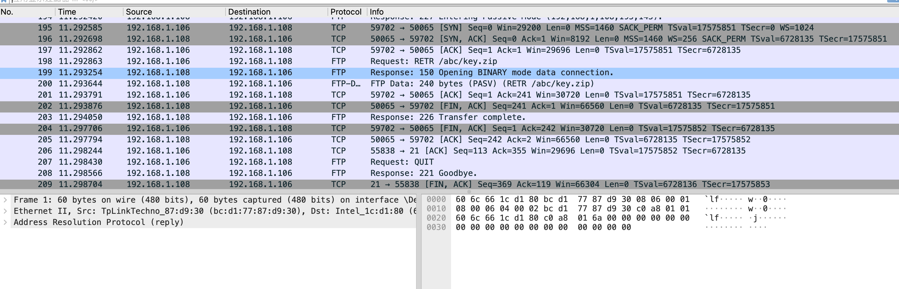
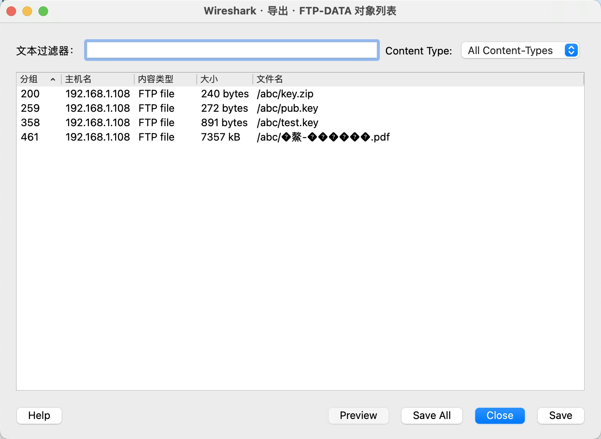
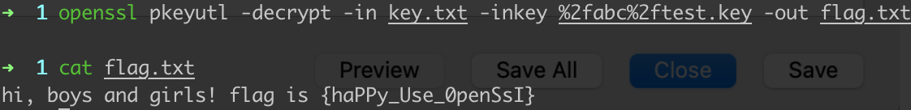

# 就在其中


## 知识点

`流量分析`

`rsa`

## 解题

打开流量包发现是FTP流量包



导出对象看看有没有什么东西



导出后解压`key.zip`得到了`key.txt`，使用命令解密

```bash
openssl pkeyutl -decrypt -in key.txt -inkey %2fabc%2ftest.key -out flag.txt
```

