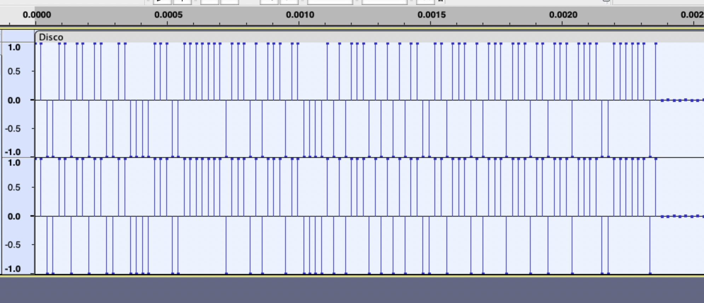

# 很普通的Disco

## 知识点

`音频波形隐藏`

`7位ASCII`

## 解题

给了一个`wav`文件，打开后看波形图，放大看发现



高位为1，低位为0

```
110011011011001100001110011111110111010111011000010101110101010110011011101011101110110111011110011111101
```

`ASCII`是7位一组

```python
a = '110011011011001100001110011111110111010111011000010101110101010110011011101011101110110111011110011111101'

for i in range(0, len(a), 7):
    print(chr(int(a[i:i+7], 2)), end='')
```

