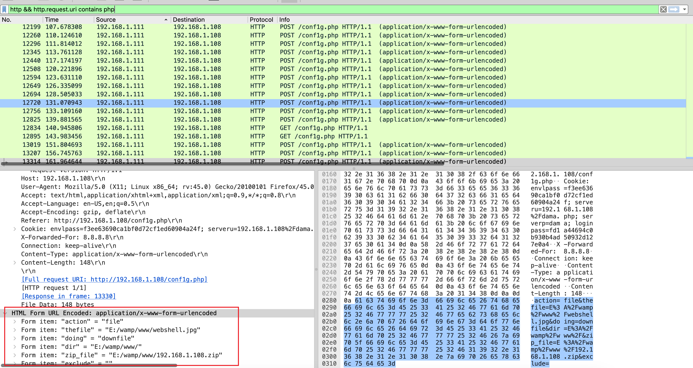
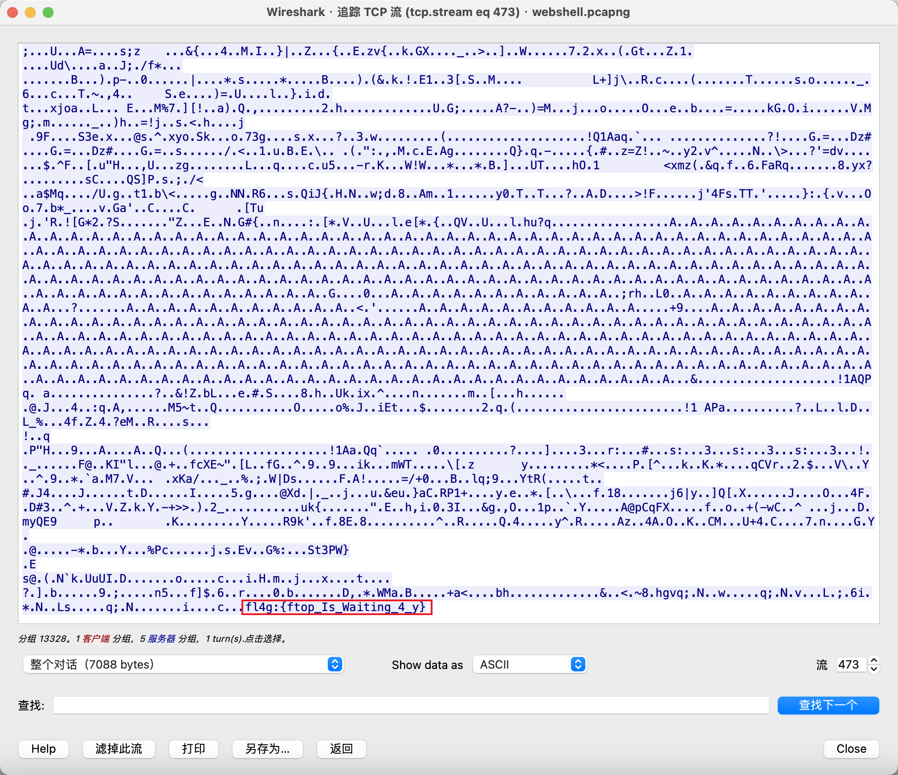

# 心仪的公司

## 知识点

`流量分析`

## 解题

首先搜索字符串没发现`flag`,查看流量包发现是`http`类的流量包，而且文件名为`webshell`，发现了`php`文件请求，筛选一下

```
http && http.request.uri contains php
```



然后在`conf1g.php`发现了类似上传文件的参数，追踪`http`流在最后发现`flag`

