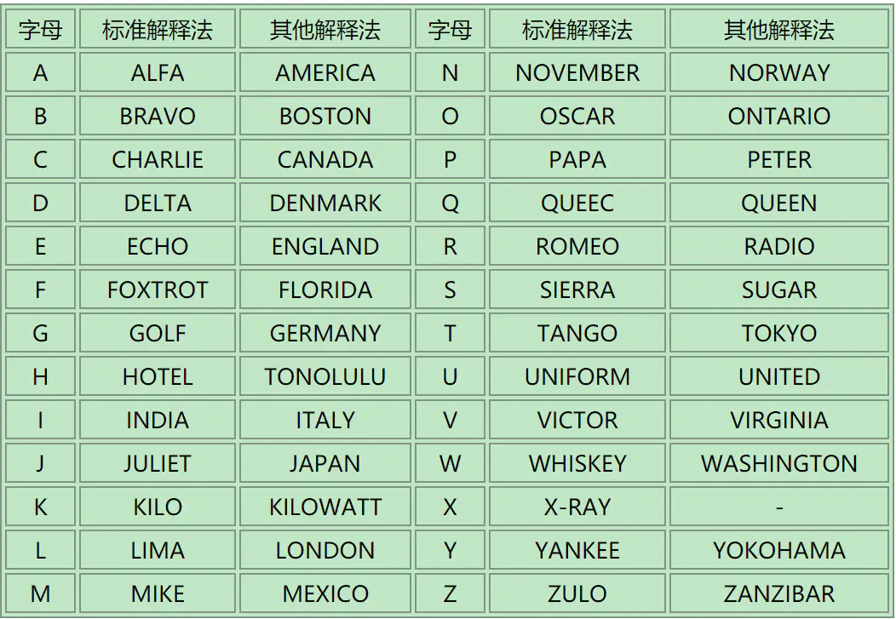

# 我们生活在南京-1

## 知识点

`音频倒放`

`业余无线电通联`

## 解题

```python
# python安装两个模块
# pip install pydub
# pip install pyaudio
# 如果脚本已经报错，RuntimeWarning: Couldn't find ffmpeg or avconv - defaulting to ffmpeg
#你可能还要安装下ffmpeg，请自行百度安装，并配置好环境 
from pydub import AudioSegment
from pydub.playback import play

#读取想要倒放的音频文件 
ted = AudioSegment.from_file("nanjing_1.mp3")
#将音频倒转
backwards = ted.reverse()
#保存倒放的音频
backwards.export("nanjing_2.mp3")
#播放倒放文件 
play(backwards)
```



radiowavesacrosstime