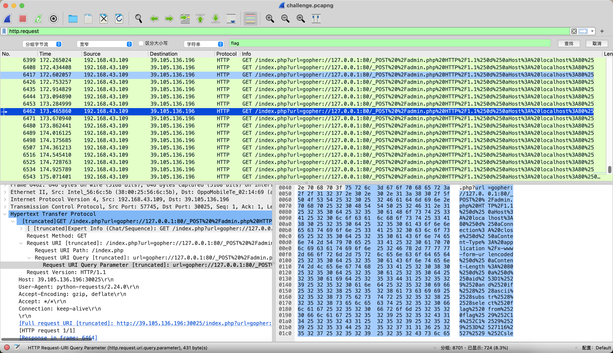

# 流量分析1

## 知识点

`python流量分析处理数据`

`sql盲注数据`

## 解题

首先用`wireshark`打开流量包，发现是一个`http`类型的流量包，过滤`http`类型的流量，发现使用了`gopher`协议与`sql注入`进行了`二次url编码`后获取`flag`



使用`python`对数据进行处理

```python
import pyshark
from urllib.parse import unquote

def update_max_value(dictionary, key, value):
    if key not in dictionary or value > dictionary[key]:
        dictionary[key] = value

dic = {}
pcap = pyshark.FileCapture('./challenge.pcapng', display_filter="http.request")

for i, v in enumerate(pcap):
    uris = unquote(unquote(v.http.request_uri_query))
    try:
        data = int(uris.split('\n')[-1].split("'")[1])
        pos = int(uris.split('\n')[-1].split(",")[1])
        update_max_value(dic, pos, data)
    except:
        # print(e)
        pass

[print(chr(x), end='') for x in dic.values()]
```

