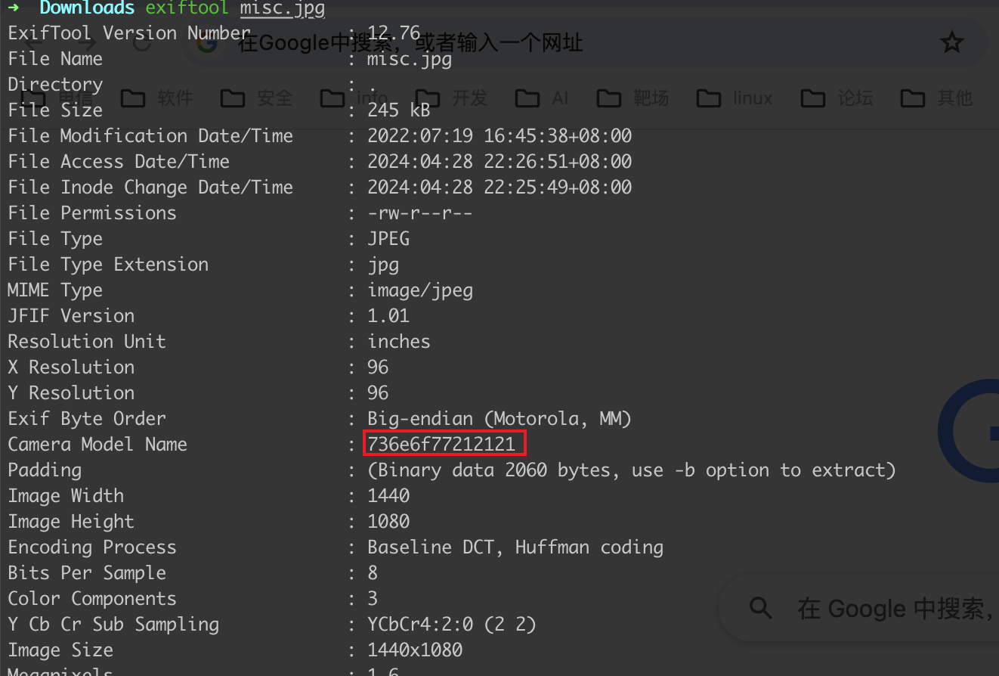
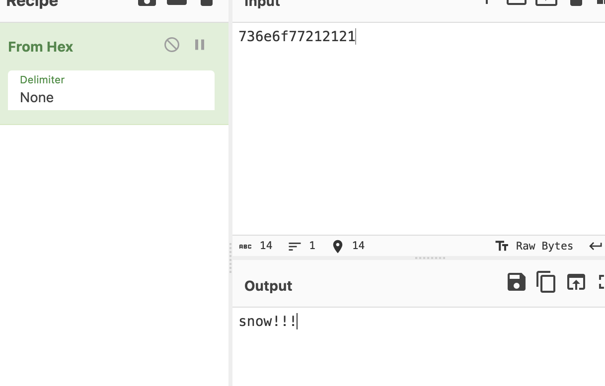
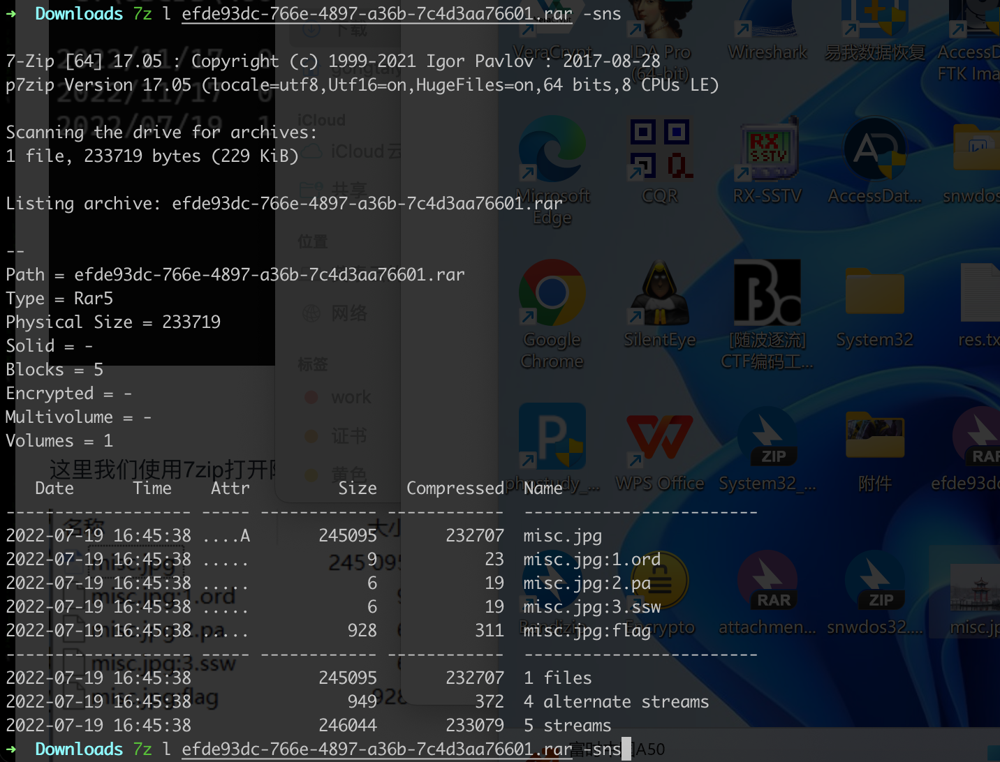
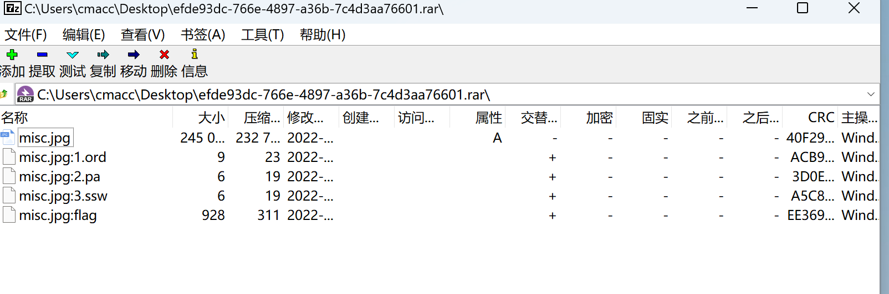
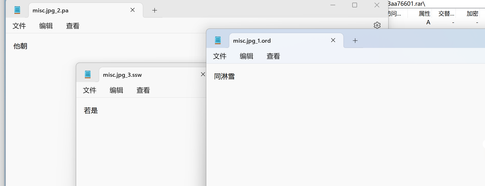
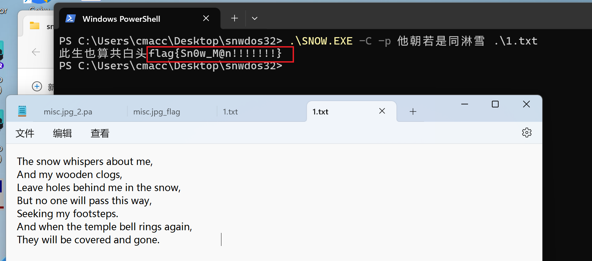

# 看雪看雪看雪

## 知识点

`snow加密`

## 解题

首先通过`exiftool`看到一串`hex`编码，解码后提示`snow`，猜测是`snow`加密





通过`7z -l -sns <filename>`发现`有隐藏文件`，使用`windows`的`7zip`打开，获得密码







然后用`snwdos`解密`misc.jpg:flag`文件，我复制内容到`1.txt`了

```bash
.\SNOW.EXE -C -p 他朝若是同淋雪 .\1.txt
```

