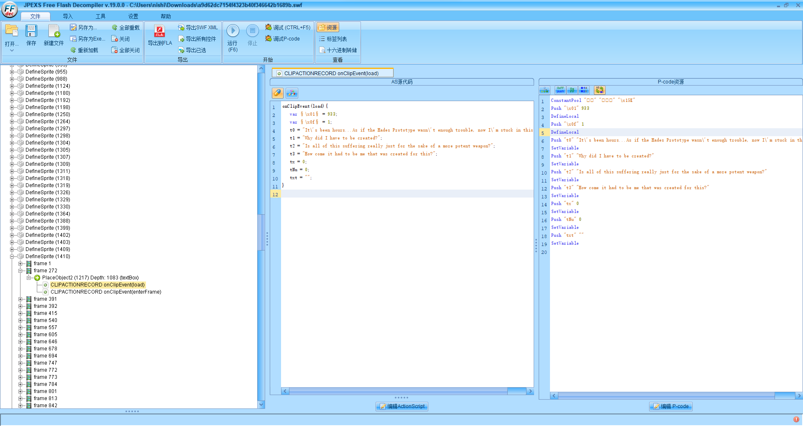
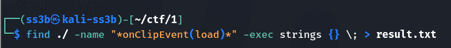
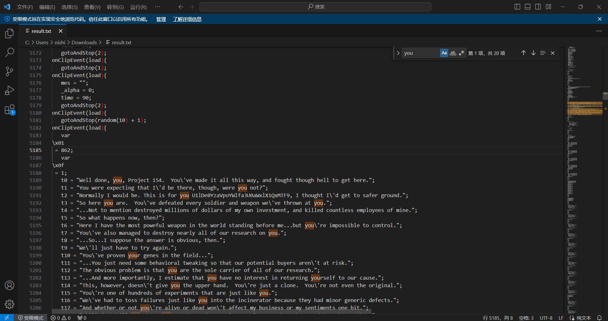

# 肥宅快乐题

## 知识点

``

## 解题

下载下来的SWF文件,打开发现是个FLASH游戏。

由于提示是注意游戏中NPC的对话，所以使用jpexs-decompiler(https://github.com/jindrapetrik/jpexs-decompiler/)反编译，搜索游戏中的第一句对话。

可以发现输出对话的部分有特征——onClipEvent(load)。于是把所有脚本全部导出，并使用
把所有具有相同特征的文件里面的文本提取出来合并。

在VScode里面打开提取出来的，搜索一些对话常见的词汇，比如I,you之类的，可以找到一串可疑的字符串（U1lDe0YzaVpoYWlfa3U0aWxlX1QxMTF9）。

将这字符串放入解码器，可以解出是SYC{F3iZhai_ku4ile_T111}，提交flag即可。