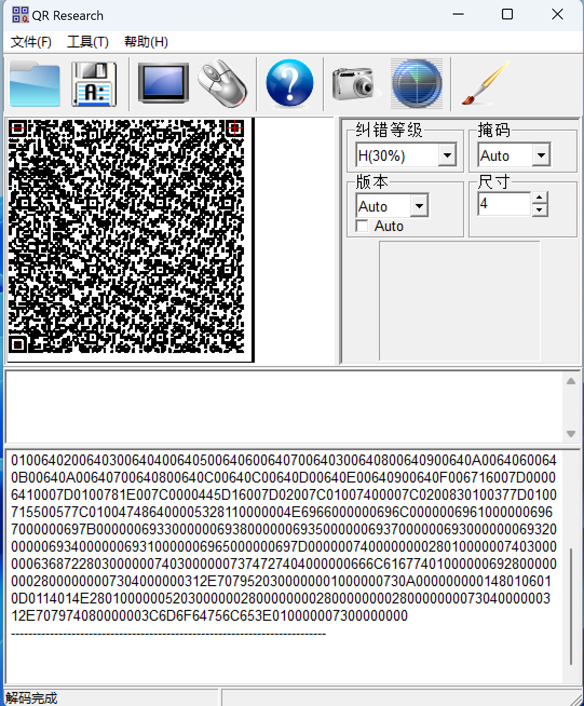
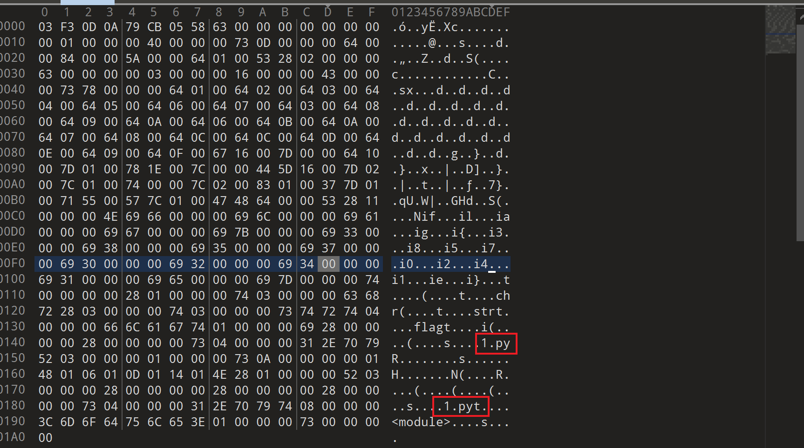
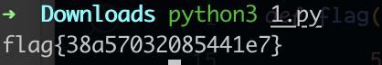

# 适合作为桌面

## 知识点

`pyc反编译`

## 解题

首先获得一个`png`文件，然后通过`StegSolve`在通道发现了二维码，扫描后给了一堆`hex`编码的内容，看起来像`Hex`文件内容，先使用`010editor`创建一个`hex`文件，然后粘贴到`010editor`中



发现是`pyc`文件格式



因为本题使用的是`python2`的`pyc`文件，使用在线网站反编译，用`compyle6`反编译出来内容是错的

```python
#!/usr/bin/env python
# visit https://tool.lu/pyc/ for more information
# Version: Python 2.7


def flag():
    str = [
        102,
        108,
        97,
        103,
        123,
        51,
        56,
        97,
        53,
        55,
        48,
        51,
        50,
        48,
        56,
        53,
        52,
        52,
        49,
        101,
        55,
        125]
    flag = ''
    for i in str:
        flag += chr(i)
    
    print flag
```

运行即可获得`flag`

